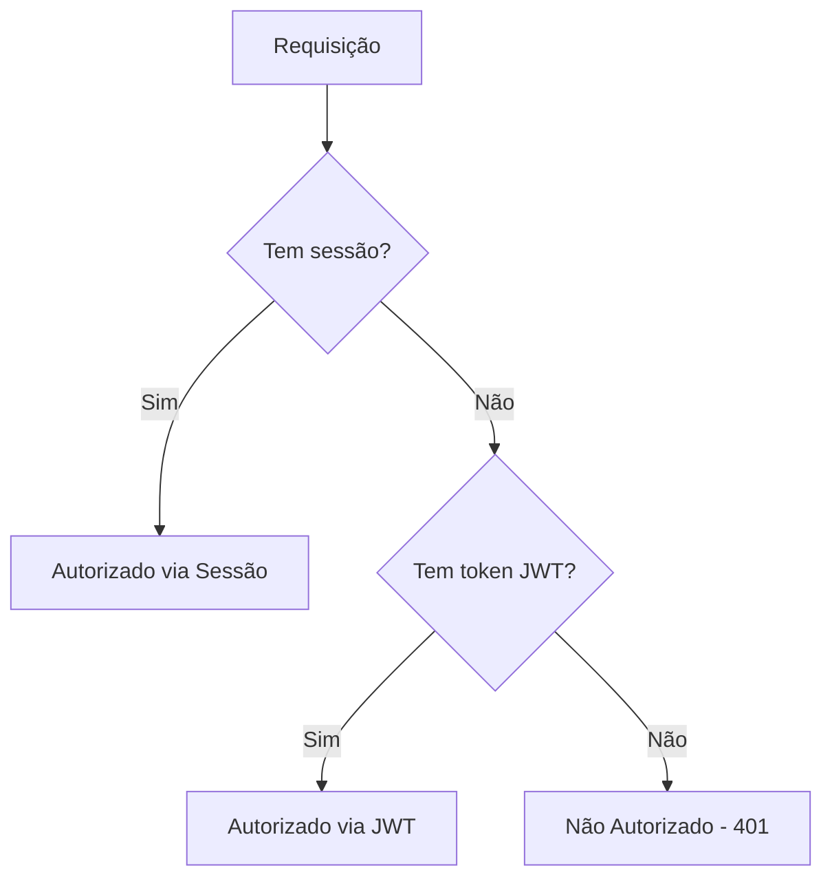
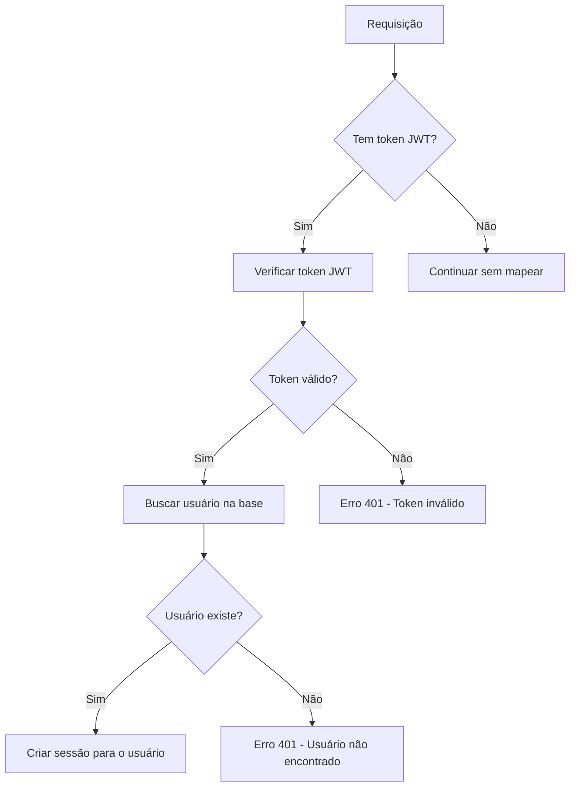

# Documentação: Sistema de Autenticação Híbrida

## Visão Geral

O sistema de autenticação híbrida permite que a aplicação valide usuários utilizando dois métodos em paralelo:

1. **Autenticação por Sessão** - Utilizando express-session + Passport (abordagem tradicional)
2. **Autenticação por Token JWT** - Utilizando Supabase Auth (abordagem moderna para APIs)

Esta abordagem híbrida resolve os seguintes problemas:

- Permite que o frontend funcione tanto no ambiente do Replit quanto fora dele
- Mantém compatibilidade com código legado que utiliza autenticação por sessão
- Adiciona suporte para clientes externos que precisam acessar as APIs usando tokens

## Arquivos Principais

### Middlewares de Autenticação

- `server/middleware/hybridAuth.ts` - Contém os middlewares principais que verificam tanto sessão quanto token JWT
- `server/middleware/auth/index.ts` - Exporta os aliases de middleware para evitar circular references
- `server/middleware/mapSupabaseUser.ts` - Middleware para mapear usuários Supabase para sessão
- `server/middleware/simpleAuth.ts` - Versão simplificada do middleware para casos menos críticos

### Clients Supabase

- `client/src/lib/supabaseClient.ts` - Configuração do cliente Supabase para o frontend
- `server/utils/supabaseClient.ts` - Configuração do cliente Supabase para o backend

### Contexto de Autenticação

- `client/src/context/SupabaseAuthContext.tsx` - Provê contexto de autenticação Supabase para o frontend
- `client/src/context/AuthContext.tsx` - Contexto de autenticação original (mantido por compatibilidade)

## Fluxo de Autenticação

### Autenticação Híbrida (hybridAuth)

### Autenticação com Mapeamento (mapSupabaseUser)

## Tipos de Middleware

1. **isAuthenticated** - Verifica se o usuário está autenticado por sessão OU token JWT
2. **isAuthenticatedWithMapping** - Verifica token JWT e mapeia para sessão automaticamente
3. **isSessionAuthenticated** - Verifica apenas autenticação por sessão
4. **isJwtAuthenticated** - Verifica apenas autenticação por token JWT

## Rotas de Teste

Para verificar o funcionamento da autenticação híbrida, use as seguintes rotas:

- `/api/auth-test/hybrid` - Verifica autenticação híbrida (sessão OU JWT)
- `/api/auth-test/mapping` - Verifica mapeamento de token JWT para sessão
- `/api/auth-test/session` - Verifica apenas autenticação por sessão
- `/api/auth-test/jwt` - Verifica apenas autenticação por token JWT
- `/api/auth-test-direct/hybrid` - Rota direta para teste de autenticação híbrida

## Configuração da Sessão

A sessão é configurada no arquivo `server/app.ts` com as seguintes características:

- Store: PostgreSQL (tabela `session`)
- MaxAge: 7 dias (604800000ms)
- Secure: Baseado no ambiente (true em produção, false em desenvolvimento)

## Notas Importantes

1. A autenticação híbrida foi implementada de forma não intrusiva, mantendo compatibilidade com o código existente.
2. Os aliases `isAuthenticated`, `isAdmin`, etc. foram mantidos para garantir compatibilidade com código antigo.
3. O Supabase Auth está configurado para utilizar tokens JWT como método primário de autenticação.
4. O mapeamento entre usuários Supabase e usuários do banco local é feito pelo email, garantindo consistência.

## Próximos Passos

- [ ] Adicionar testes de integração completos para os diferentes fluxos de autenticação
- [ ] Implementar refresh token para renovação automática de tokens JWT
- [ ] Criar interface administrativa para gestão de tokens e sessões
- [ ] Melhorar a documentação do client Supabase para o frontend